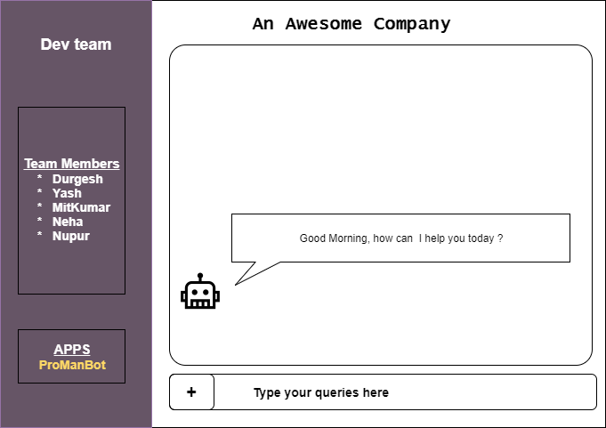
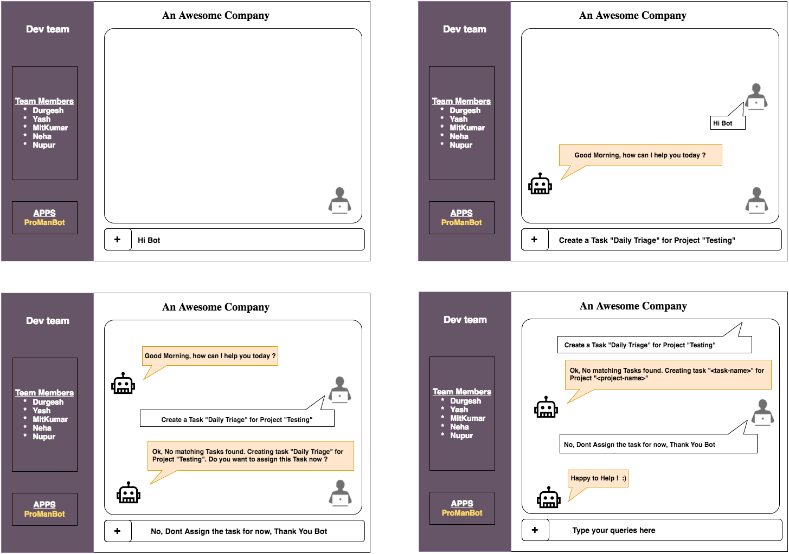
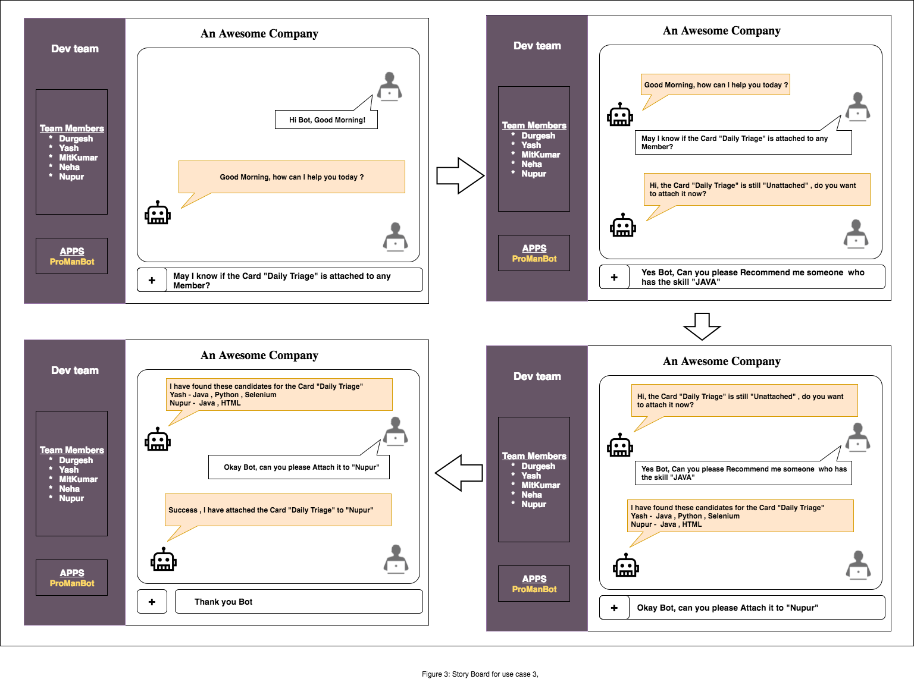
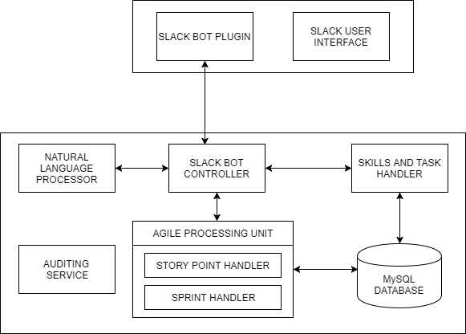

## Problem Statement
Effective Project Management and its timely completion require a lot of complicated and manual efforts by the Project Managers to identify different small tasks associated with different projects and assign these tasks to appropriate team members. The project manager also has to keep track of the current status of the todo and ongoing tasks related to different projects. Moreover, it is also expected from the developers and testers to keep track of the individual tasks assigned to them, which is done usually by using some basic tools such as sticky notes.

Since humans are prone to errors, there is a high probability that issues will arise in the situations discussed above. One such example could be, the project manager assigns a task to a team member without knowing their current workload (current assigned tasks) or, if their skills are a fit for the task which could have been avoided with a simple automation.

## Bot Description

ProManBot is a DevOps bot which is designed to handle several problems related to project development life-cycle on ‘Trello’ platform. Project managers can make use of this bot to create cards for each task, assign them to team members and receive notifications related to it. Engineers can talk to the bot to know their assigned cards and related details such as due date, labels, comments etc. Since, the bot tackles several Project Management related issues, it is directly related to the topic of Agile Development Technique discussed in class.

ProManBot can be considered as a Personal Assistant bot which is based on Space Reactors and Responders design patterns that interacts with the users and adapts its response based on each user type viz. manager, or team member. The bot responds to user’s queries based on information stored on Trello’s platform

## Use Cases

1.  Team Members interact with the Bot to update their details (such as bio, email etc) in the Trello
```
=> Prerequisite: - Team Member's profile is available in Trello, board already exists.
=> Flow:  - Team Member asks the bot to update their profile, bot invokes Trello’s REST API and updates the member profile of the user.
```

2.  Project Manager creates new cards with details such as name, desc, due date, id of the board etc.
```
=> Prerequisite: - Board already exists and Project manager knows about various tasks(cards) that needs to be associated with the board.
=> Flow:    - Manager informs bot to create a new card for the board 
            - Manager decides whether to attach the card to a team member at that time or some time later
```

3.  Project Manager wants to distribute cards among team members
```
=> Prerequisite: - Cards exist in the Trello board
                 - Team members have already updated their Profile details into the Trello board
=> Flow:    - Manager asks the bot to give information about the cards which are not yet attached to any team members
            - Bot returns a list of cards to the project manager
            - Manager then either attaches the card to a specific team member by name or asks for suggestions
                + If manager has asked for suggestions, Bot suggests the team member names based on their skills and then                     manager attaches the card to a particular team member based on the suggestions given by the bot
```

4.  Reminding user through Notifications.
```
=> Prerequisite: - Cards exist in the Trello board and is already attached to a team member but the card is still in the todo list of the team member
=> Flow: - Manager asks the bot to remind a member about certain card
```

5.  Creating a weekly summary of pending and completed cards
```
=> Prerequisite: - Cards regarding a board exist in the Trello
                 - Team members have updated status of their cards
=> Flow: - Manager asks the bot to create a weekly summary of completed and incomplete cards
```

## Design Sketches

#### Wireframe mockup



#### Story Board for Use Case 2


#### Story Board for Use Case 3


## Architecture Design

#### Architecture Design Pattern(_Data centered Pattern_)  
All the information regarding the skills of team members is stored on Trello’s database and because of this aspect, the project follows a data-centered pattern. Also, the information regarding status of cards assigned to team members on the board’s list is updated dynamically. Moreover, all the team members can independently update this information without affecting any other team member’s lists. Therefore, by considering the above mentioned aspects, one can say that this project follows a blackboard data-centered pattern.



1. __SLACK USER INTERFACE__ : This component is the webpage on the "slack.com" where user can go by clicking on the app "ProManBot" after login.

2. __SLACK MESSAGING API__ : This is a component inside slack's infrastructure which provides Websocket based API for real time messaging. This component is essential to help bot respond to user's queries in a real time and triggers events inside slack bot controller.

3. __NATURAL LANGUAGE PARSER__ : Natural language parser is the component which takes the input sentences from user and categorise them into intents. This component can either be an internal feature such as a library or an external service provider such as "API.AI".

4. __SLACK BOT API HANDLER__ : This component is responsible for connecting and coordinating among all the other components. This component creates a web-socket with Slack Messaging API and invokes respective functions based on events trigger by user's chat.

5. __TRELLO REST API CLIENT__ : This component calls REST API’s on Trello platform to either perform actions or fetch information about cards/ members.

6. __TRELLO REST API SERVER__ : This is a web interface which is deployed inside Trello’s platform which manages all the REST API calls. This is used to handle actions such as card creation, updates etc. 

7. __SLACK TRELLO TOKEN MAP__ : This unit is used to handle tokens across platforms i.e. map slack user to trello account using oauth tokens.

#### Constraints

1. A team member cannot ask the bot to assign him/her a card. This privilege is only available to the project manager.
2. A team member can neither ask the bot about the status of other team members’ cards nor it can ask about the cards          assigned to other team members.

#### Additional Patterns

#### Data Flow Pattern (_Batch Sequential flow_)  
In order to attach members to different cards within a board, the bot can suggest a list of members to the manager who has the required skillset needed for the successful completion of those tasks(cards in Trello). But before the bot can provide this suggestion to the manager, the bot has to collect skills information from the profile of all the team members and then segregate the team members depending on the skill required for that particular task. Only after this segregation is completed, suggestion to the project member can take place. Thus, this project can also resemble batch sequential data flow pattern. 

