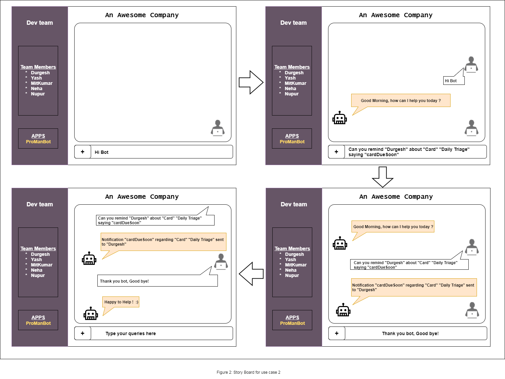
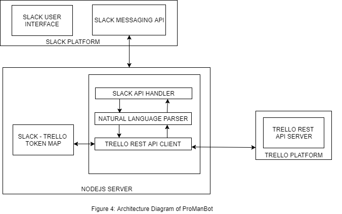

## Problem Statement
Effective Project Management and its timely completion require a lot of complicated and manual efforts by the Project Managers to identify different small tasks associated with different projects and assign these tasks to appropriate team members. The project manager also has to keep track of the current status of the todo and ongoing tasks related to different projects. Moreover, it is also expected from the developers and testers to keep track of the individual tasks assigned to them, which is done usually by using some basic tools such as sticky notes.

Since humans are prone to errors, there is a high probability that issues will arise in the situations discussed above. One such example could be, a user needs a reminder about his task's deadline which is to be completed by the next day, and a simple notification using automation in this case would be helpful.

## Bot Description

ProManBot is a DevOps bot which is designed to handle several problems related to Project Management Life-Cycle on ‘Trello’ platform. Project managers can make use of this bot to attach cards (tasks) to a list in a story-board and receive notifications related to it. Engineers can talk to the bot to know their assigned cards and related details such as due date, labels, comments etc. Since, the bot tackles several Project Management related issues, it is directly related to the topic of Agile Development Technique discussed in class.

ProManBot can be considered as a Personal Assistant bot which is based on Space Reactors and Responders design patterns that interacts with the users and adapts its response based on each user type viz. manager, or team member. The bot responds to user’s queries based on information stored on Trello’s platform.

## Use Cases

1. Interaction with Trello Cards and their Assigned lists
```
=> Prerequisite: 
- Different storyboards along with their respective todo lists already exists in Trello. 
- Three types of lists (todo, doing and done) are already created for each story board

=> Main Flow:   
- Manager asks the bot to add a new Card in the todo list of a specific StoryBoard
- A User(project manager or a team member) asks the Bot to remove the Card, say 'Remove ssh key' from the ‘todo’ list of a particular StoryBoard when the task related to that card is finished

=> Sub Flows:   
- [S1] There can exist multiple cards with the same name, say “Remove ssh key”  under different StoryBoards (Story 1, Story 2,..) on Trello. Thus, the bot prompts the user to specify the name of the StoryBoard too to which the card, that needs to be removed, belongs to. 
- [S2] The bot moves the card from the todo list of the user specified StoryBoard to the ‘done’ list, thereby denoting that the task related to that card is completed. 

=> Alternative Flows:   
- [E1] A new card can only be added in the todo list of a StoryBoard. If the user asks the bot to create a new card in any list other than the todo list, that card will not be created. An error message is printed stating that “Card can only be added in the todo list of the StoryBoard” 
- [E2] User asks for removal of a card which does not exist in the todo list of that Story Board. An error message is printed asking the User to check the StoryBoard name associated with the card that needs to be removed.
```

2.  Reminding user through Notifications.
```
=> Prerequisite: - Cards exist in the Trello board and is already attached to a team member but the card is still in the todo list of the team member
=> Flow: - Manager asks the bot to remind a member about certain card
```

3.  Creating a weekly summary of pending and completed cards
```
=> Prerequisite: - Cards regarding a board exist in the Trello
                 - Team members have updated statuses of their cards
                 
=> Main Flow: - Manager asks the bot to create a weekly summary of completed and incomplete cards

=> Sub Flows:   
- [S1] By default bot will start creating summary for current week and ask manager if they want to create summary of current week or any other week.
- [S2] If manager responds with any other week, bot will start preparing summary of the dates or week specified by manager and display it else bot will show the summary of current week.

=> Alternative Flows:   
- [E1] If team members have not updated status of any of the task for that week, bot will display all the tasks as incomplete even if the due date has passed. 
- [E2] If no card is available for the week or date duration mentioned by the manager, an error is printed saying no cards found for the specified duration.
- [E3] The dates specified by the manager must be in correct format e.g. 'mm/dd/yyyy', 'mm/dd/yy', 'mm/dd'. For invalid values error message should be printed saying please enter correct date format e.g. 'mm/dd/yyyy', 'mm/dd/yy', 'mm/dd'.


```

## Design Sketches

#### Wireframe mockup


#### Story Board for Use Case 2


#### Story Board for Use Case 3


## Architecture Design

#### Architecture Design Pattern(_Data centered Pattern_)  
All the information regarding the skills of team members is stored on Trello’s database and because of this aspect, the project follows a data-centered pattern. Also, the information regarding status of cards assigned to team members on the board’s list is updated dynamically. Moreover, all the team members can independently update this information without affecting any other team member’s lists. Therefore, by considering the above mentioned aspects, one can say that this project follows a blackboard data-centered pattern.



1. __SLACK USER INTERFACE__ : This component is the webpage on the "slack.com" where user can go by clicking on the app "ProManBot" after login.

2. __SLACK MESSAGING API__ : This is a component inside slack's infrastructure which provides Websocket based API for real time messaging. This component is essential to help bot respond to user's queries in a real time and triggers events inside slack bot controller.

3. __NATURAL LANGUAGE PARSER__ : Natural language parser is the component which takes the input sentences from user and categorise them into intents. This component can either be an internal feature such as a library or an external service provider such as "API.AI".

4. __SLACK BOT API HANDLER__ : This component is responsible for connecting and coordinating among all the other components. This component creates a web-socket with Slack Messaging API and invokes respective functions based on events trigger by user's chat.

5. __TRELLO REST API CLIENT__ : This component calls REST API’s on Trello platform to either perform actions or fetch information about cards/ members.

6. __TRELLO REST API SERVER__ : This is a web interface which is deployed inside Trello’s platform which manages all the REST API calls. This is used to handle actions such as card creation, updates etc. 

7. __SLACK TRELLO TOKEN MAP__ : This unit is used to handle tokens across platforms i.e. map slack user to trello account using oauth tokens.

#### Constraints

1. A team member can neither ask the bot about the status of other team members’ cards nor it can ask about the cards          assigned to other team members.

#### Additional Patterns

#### Data Flow Pattern (_Batch Sequential flow_)  
In order to provide weekly summary of pending and completed cards within a story board, the bot will have to provide a list of pending and completed cards to the manager or any other team member. For providing this list, the bot has to collect the status of all the cards present within different storyboards and then segregate the cards according to which card is assigned to which team member. Only after this segregation is completed, the list of pending and completed cards can be provided to the manager or any other team member who made a weekly summary request. Thus, this project can also resemble batch sequential data flow pattern. 

